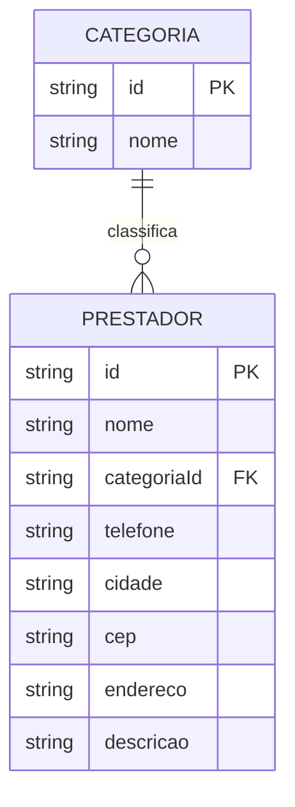

# Serviços Locais — Especificação Técnica (architecture.md)

## Design Tokens

> Preencher após a prototipação no Google Stitch/Figma (Entrega 1). Sugestão inicial, ajuste conforme o protótipo:

- **Cores:** primária (ex: azul `#2563EB` — confiança/serviço), secundária (ex: laranja `#F97316` — ação/contato), neutras para texto e fundo.
- **Tipografia:** uma fonte para títulos (ex: Poppins/Montserrat, mais forte) e uma para corpo de texto (ex: Inter/Roboto, mais legível).

## Modelo de Dados

- **Categoria:** ex. Pedreiro, Eletricista, Encanador, Diarista, Pintor, Jardineiro.
- **Prestador:** perfil do profissional, vinculado a uma categoria.

## Tecnologias

- **Framework CSS:** Bootstrap (sugestão — componentes prontos de Navbar, Cards e Modal já cobrem boa parte do escopo mínimo e é permitido pela disciplina; Tailwind está vetado). Pode trocar por Materialize/Bulma se preferir outro visual.
- **JavaScript:** Vanilla JS (ES6+), com `fetch`/`async-await` para as chamadas assíncronas.
- **Persistência local:** Web Storage (`localStorage`) para guardar a lista de prestadores favoritos do visitante.
- **API fake:** JSON Server, servindo as entidades `categorias` e `prestadores` (cadastro, listagem, edição e exclusão).
- **API pública:** ViaCEP — no formulário de cadastro do Prestador, ao digitar o CEP, o endereço (rua, bairro, cidade) é preenchido automaticamente via requisição assíncrona.

## Componentes que serão substituídos pelo Framework CSS

1. **Navbar** — atualmente estática no protótipo, será substituída pela navbar responsiva do Bootstrap.
2. **Cards de Prestador** — usados na listagem de resultados de busca.
3. **Modal** — usado para exibir os detalhes completos de um prestador ao clicar em "ver mais".

## Páginas (mínimo 3)

1. **Home / Busca** — listagem de prestadores com filtro por categoria e cidade.
2. **Cadastro de Prestador** — formulário com validação (campos obrigatórios, regex para telefone, autopreenchimento via ViaCEP).
3. **Detalhes do Prestador** — página ou modal com informações completas e opção de favoritar.