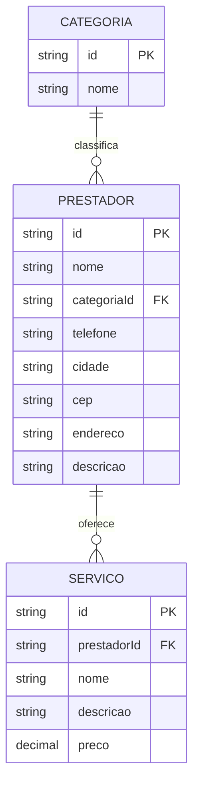

# Serviços Locais — Arquitetura do Projeto

## Identificação

- **Aluno:** João Gabriel Camilo Pires
- **Projeto:** Serviços Locais

## Design System

O projeto utiliza uma identidade visual consistente entre as versões mobile e desktop do protótipo criado no Google Stitch.

### Cores

- **Cor primária:** `#E05A2B`
- **Cor secundária:** `#133842`
- **Cor terciária:** `#E2E8F0`
- **Cor neutra:** `#0F172A`

A cor primária laranja será utilizada principalmente em botões e ações de destaque, ajudando o usuário a identificar rapidamente os elementos interativos mais importantes.

A cor secundária azul escuro cria contraste com o laranja e será utilizada em textos, ícones e elementos que precisam de maior destaque visual.

Os tons claros serão utilizados principalmente nos fundos, campos e elementos secundários, mantendo a interface limpa e facilitando a leitura.

### Tipografia

A tipografia escolhida foi **Plus Jakarta Sans**.

Ela possui um estilo moderno, simples e de fácil leitura, funcionando bem tanto em telas menores, como celulares, quanto em layouts desktop.

### Logo

A identidade visual do projeto utiliza uma logo formada por elementos relacionados diretamente à proposta do Serviços Locais:

- o **marcador de localização** representa a busca por serviços próximos;
- a **casa** representa o ambiente onde muitos desses serviços são realizados;
- a **ferramenta** representa os profissionais prestadores de serviço.

## Tecnologias

As principais tecnologias previstas para o desenvolvimento são:

- **Framework CSS:** Bootstrap 5.3.8
- **JavaScript:** JavaScript ES6+
- **Biblioteca JavaScript:** jQuery
- **API Pública:** ViaCEP
- **API Fake:** JSON Server
- **Persistência local:** `localStorage`

## Framework CSS

O framework CSS escolhido foi o **Bootstrap 5.3.8**.

Ele será utilizado para construir o layout responsivo e substituir elementos visuais do protótipo por componentes e classes próprias do framework.

O Bootstrap foi escolhido porque possui:

- sistema de grid responsivo;
- componentes prontos;
- classes utilitárias para espaçamento e organização;
- boa documentação;
- suporte para layouts mobile e desktop.

Além disso, os componentes JavaScript do Bootstrap 5 não dependem de jQuery.

## Componentes do Bootstrap

No protótipo foram identificados vários elementos que poderão ser construídos utilizando componentes ou classes do Bootstrap.

Os principais são:

1. **Navbar** — utilizada na navegação da aplicação.
2. **Cards** — utilizados para exibir os prestadores de serviço.
3. **Formulários** — utilizados no cadastro e na edição dos dados dos usuários.
4. **Buttons** — utilizados em ações como cadastrar, salvar, favoritar e entrar em contato.
5. **Badges** — podem ser utilizados para categorias, estados e informações rápidas.

Esses elementos já aparecem visualmente no protótipo e serão substituídos pelas respectivas estruturas do Bootstrap durante a implementação.

## API Pública

A API pública escolhida para o projeto foi a **ViaCEP**.

Ela será utilizada durante o cadastro de prestadores para consultar automaticamente informações de endereço a partir do CEP informado.

A ViaCEP foi escolhida porque:

- não exige chave de autenticação;
- possui resposta simples em JSON;
- facilita o preenchimento do formulário;
- reduz a quantidade de informações que o usuário precisa digitar;
- ajuda a manter cidade e bairro padronizados.

### Endpoint

```text
https://viacep.com.br/ws/{cep}/json/
```

Caso o CEP seja válido, poderão ser utilizados dados como:

- logradouro;
- bairro;
- cidade;
- estado.

Caso o CEP seja inválido ou não seja encontrado, o sistema deverá informar o usuário.

## API Fake

Durante o desenvolvimento será utilizado o **JSON Server** para simular uma API e armazenar os dados da aplicação.

Os principais dados serão:

- categorias;
- prestadores;
- serviços.

## Persistência Local

O `localStorage` será utilizado para armazenar os prestadores favoritos do usuário no próprio navegador.

## Modelo de Dados


```mermaid
erDiagram
    CATEGORIA ||--o{ PRESTADOR : classifica
    PRESTADOR ||--o{ SERVICO : oferece

    CATEGORIA {
        string id PK
        string nome
    }

    PRESTADOR {
        string id PK
        string nome
        string categoriaId FK
        string telefone
        string cidade
        string cep
        string endereco
        string descricao
    }

    SERVICO {
        string id PK
        string prestadorId FK
        string nome
        string descricao
        decimal preco
    }
```

### Categoria

Representa o tipo de serviço, como eletricista, pedreiro, encanador, diarista, pintor ou jardineiro.

### Prestador

Representa o profissional cadastrado na plataforma.

### Serviço

Representa um serviço oferecido por um prestador.

## Telas Principais do Protótipo

O protótipo possui versões mobile e desktop e contempla as seguintes telas:

1. **Home / Busca** — pesquisa e seleção de categorias.
2. **Listagem de Prestadores** — exibição dos profissionais encontrados.
3. **Perfil do Prestador** — informações detalhadas do profissional.
4. **Favoritos** — profissionais salvos pelo usuário.
5. **Cadastro de Prestador** — formulário para cadastro de novos profissionais.
6. **Editar Perfil / Excluir Cadastro** — alteração dos dados cadastrados.
7. **Perfil do Cliente** — informações pessoais e acesso aos favoritos.

## Responsividade

O protótipo foi desenvolvido considerando versões **Mobile** e **Desktop**.

Durante a implementação, o sistema de grid e os breakpoints do Bootstrap serão utilizados para adaptar a disposição dos elementos de acordo com o tamanho da tela.