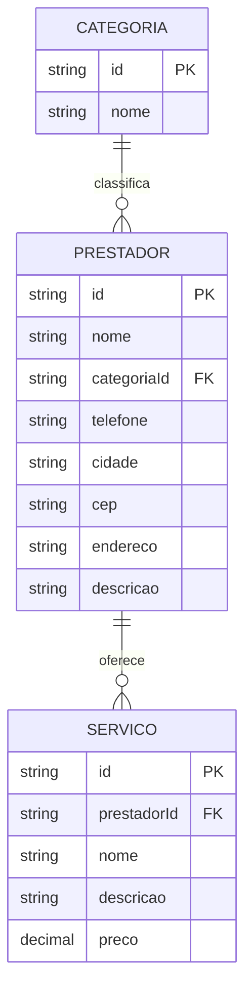

# Serviços Locais — Especificação Técnica

## Design Tokens

Os principais estilos visuais definidos no protótipo são:

- **Cor primária:** `#E05A2B`
- **Cor secundária:** `#133842`
- **Cor terciária:** `#E2E8F0`
- **Cor neutra:** `#0F172A`
- **Tipografia:** Plus Jakarta Sans

Esses padrões serão usados nos botões, textos, cards, campos de busca e demais componentes da aplicação.

## Modelo de Dados


```mermaid
erDiagram
    CATEGORIA ||--o{ PRESTADOR : classifica
    PRESTADOR ||--o{ SERVICO : oferece

    CATEGORIA {
        string id PK
        string nome
    }

    PRESTADOR {
        string id PK
        string nome
        string categoriaId FK
        string telefone
        string cidade
        string cep
        string endereco
        string descricao
    }

    SERVICO {
        string id PK
        string prestadorId FK
        string nome
        string descricao
        decimal preco
    }
```

- **Categoria:** tipo de serviço, como pedreiro, eletricista, diarista etc.
- **Prestador:** profissional cadastrado na plataforma.
- **Serviço:** serviço oferecido por um prestador.

## Tecnologias

- **Framework CSS:** Bootstrap 5.3.8
- **JavaScript:** Vanilla JavaScript (ES6+)
- **API Pública:** ViaCEP
- **API Fake:** JSON Server
- **Persistência local:** `localStorage`

O Bootstrap será utilizado para criar o layout responsivo e componentes como navbar, cards, formulários e modal.

O JSON Server será usado para armazenar os dados de categorias, prestadores e serviços durante o desenvolvimento.

O `localStorage` será utilizado para salvar os prestadores favoritos do visitante.

A ViaCEP será utilizada no cadastro do prestador para buscar o endereço automaticamente a partir do CEP.

## Componentes do Bootstrap

Os principais componentes que serão utilizados são:

1. **Navbar** — navegação do site.
2. **Cards** — listagem dos prestadores.
3. **Modal** — exibição dos detalhes do prestador.
4. **Formulários** — cadastro e edição de prestadores.

## Páginas

1. **Home / Busca** — listagem e filtros de prestadores.
2. **Cadastro de Prestador** — formulário de cadastro com validação e ViaCEP.
3. **Detalhes do Prestador** — informações completas e opção de favoritar.

## ViaCEP

No formulário de cadastro, o usuário informa o CEP e o sistema busca automaticamente informações como rua, bairro, cidade e estado.

Endpoint:

```text
https://viacep.com.br/ws/{cep}/json/
```

Caso o CEP seja inválido, será exibida uma mensagem de erro.

## Favoritos

Os favoritos serão armazenados no `localStorage` do navegador e não terão uma entidade própria no `db.json`.